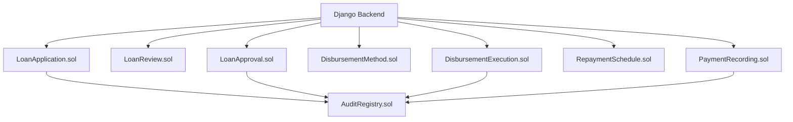

### Contract Architecture (Mermaid)

```mermaid
graph TD
  Backend[Django Backend]
  LoanApp[LoanApplication.sol]
  LoanReview[LoanReview.sol]
  LoanApproval[LoanApproval.sol]
  DisbursementMethod[DisbursementMethod.sol]
  DisbursementExec[DisbursementExecution.sol]
  RepaymentSchedule[RepaymentSchedule.sol]
  PaymentRecording[PaymentRecording.sol]
  AuditRegistry[AuditRegistry.sol]

  Backend --> LoanApp
  Backend --> LoanReview
  Backend --> LoanApproval
  Backend --> DisbursementMethod
  Backend --> DisbursementExec
  Backend --> RepaymentSchedule
  Backend --> PaymentRecording
  LoanApp --> AuditRegistry
  LoanApproval --> AuditRegistry
  DisbursementExec --> AuditRegistry
  PaymentRecording --> AuditRegistry

``` 

This diagram shows the logical split of responsibilities across contracts and the central AuditRegistry for immutable logs.
