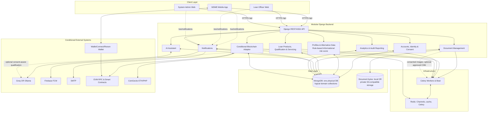

# Updated System Architecture

## Interpretation

- **Client layer:** Flutter serves MSME customers. React contains separate loan-officer and admin experiences with distinct routes/permissions. Kiosk has no source evidence.
- **Backend:** the `/api/` Django URL dispatcher is the real API edge, not a standalone gateway. The labeled domains are modules in one application, not verified microservices.
- **AI:** assistant is Groq/Ollama-backed English/Tagalog chat; risk scoring is deterministic/informational; document classification is conditional on an approved MobileNetV2 artifact.
- **Data:** MongoDB is one physical database with logical collections. Document metadata is MongoDB; document bytes are local development storage or private S3-compatible storage.
- **Infrastructure:** Redis supports Channels, caching and Celery; Celery/beat handles background document, lifecycle, reconciliation and blockchain work.
- **External:** FCM, SMTP, storage, LLM, EVM and CoinGecko have code paths but activation depends on runtime configuration. BPI is excluded: there is no implementation evidence.

## Major corrections

1. Replaced API Gateway with Django REST/ASGI API.
2. Added audit analytics, Redis/Celery, WebSockets, object storage, push/email, and optional blockchain/wallet flows.
3. Renamed Loan Recommendation to Loan Products, Qualification & Servicing.
4. Corrected AI and MongoDB labels; removed unsupported BPI and unverified kiosk.
